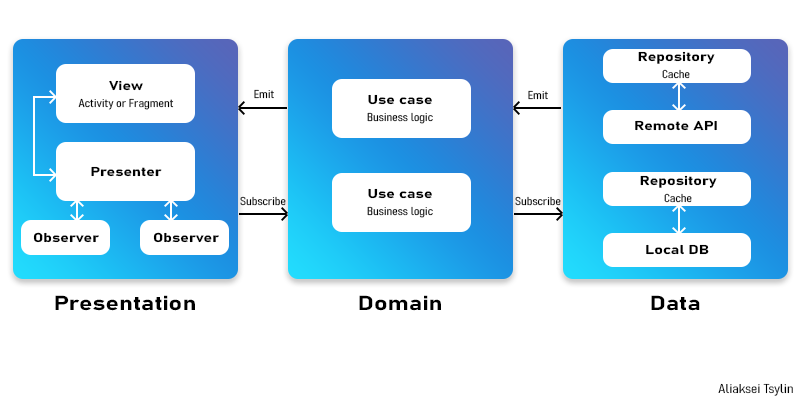

# Kotlin Clean Architecture base project

I use this code template for my new projects from scratch where it is required to use Kotlin and MVP pattern. This architecture is optimized for Clean Architecture paradigm.
It uses latest and most popular technologies e.g. Dagger2, RxJava etc.

## Benefit

* Makes your new project clean
* Isolates UI, business logic and data sources' responsibilities
* Testable
* Avoids multi-threading problems

## Approach of Clean Architecture for Android
There are 3 layers in the project: Data, Domain and Presentation(UI), and the UI layer contains view and presenters.

## Multi-threading
Base `UseCase` class handles the thread of Rx chains, it puts  whole chain on IO thread, and then changes back to Android main thread(UI thread) for the steps after use case execution. That means when you write the project based on this project, then you don't have to worry about any multi-threading issue.

## Requirements &amp; configurations
#### Requirements
- JDK 8
- Android SDK API 26
- Kotlin Gradle plugin 1.2.30

#### Configurations
- minSdkVersion=21
- targetSdkVersion=26

## Language
*   [Kotlin](https://kotlinlang.org/)

## Libraries
*   [AndroidX](https://developer.android.com/jetpack/androidx)
*   [Dagger 2](https://google.github.io/dagger/)
*   [RxJava2](https://github.com/ReactiveX/RxJava/wiki/What's-different-in-2.0)
*   [RxAndroid](https://github.com/ReactiveX/RxAndroid)
*   [OkHttp](http://square.github.io/okhttp/)
*   [Retrofit](http://square.github.io/retrofit/)
*   [Gson](https://github.com/google/gson)
*   [JUnit 4](https://junit.org/junit4/)
*   [Mockito](http://site.mockito.org/)
*   [PowerMock](https://github.com/powermock/powermock/)
*   [Espresso](https://developer.android.com/training/testing/espresso/index.html)

